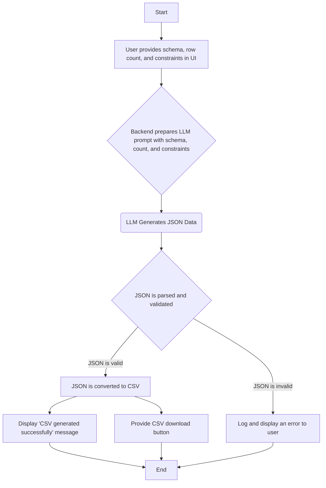

# Synthetic Data Generator using LLM

This project is a Synthetic Data Generator powered by a Large Language Model (LLM) built with Streamlit. It allows users to generate realistic, structured datasets in CSV format based on a custom schema, a specified number of rows, and custom logical constraints.

## ✨ Features

* **Web Interface**: A simple and intuitive web UI built with Streamlit for user input.

* **LLM-Powered Generation**: Leverages the Groq API for fast and efficient synthetic data generation.
<!--
* **Dynamic Constraints**: Allows users to provide logical rules (e.g., "if X is Y, then Z must be 0") to ensure data consistency and accuracy.
-->
* **Modular Design**: A clean and maintainable folder structure separating different concerns like configuration, logging, and data generation logic.

* **Configuration-Driven**: All file paths, LLM settings, and prompt templates are managed through `config.yaml`, `params.yaml`, and `prompt_template.yaml`.

* **Robust Logging**: Logs are generated for every major step, making debugging and monitoring easy.


* **Error Handling**: Gracefully handles invalid inputs and malformed LLM responses.

## 🚀 Workflow

The following diagram illustrates the end-to-end workflow of the synthetic data generator, from user input to final output.



## Project Structure
```
synthetic-data-generator/
├── .env
├── config/ 
|    └── config.yaml
├── params.yaml
├── prompt_template.yaml
├── main.py
├── requirements.txt
├── app.py
├── src/
│   ├── synthetic_data_generator/
│   │   ├── init.py
│   │   ├── components/
│   │   │   ├── init.py
│   │   │   └── data_generator.py
│   │   ├── config/
│   │   │   ├── init.py
│   │   │   └── configuration.py
│   │   ├── constants/
│   │   │   ├── init.py
│   │   │   └── constants.py
│   │   ├── entity/
│   │   │   ├── init.py
│   │   │   └── config_entity.py
│   │   ├── logging/
│   │   │   ├── init.py
│   │   │   └── logger.py
│   │   └── utils/
│   │       ├── init.py
│   │       └── common.py
```
## 🛠️ Technologies Used

* **Python:** The core programming language.

* **Streamlit:** For building the interactive web application UI.

* **Groq API:** Provides fast inference for the Large Language Model.

* **uv:** A high-performance package installer used for managing dependencies.

* **YAML:** For structured project configuration (`config.yaml`, `params.yaml`, `prompt_template.yaml`).

* **`python-dotenv`:** For managing environment variables, such as the Groq API key.

* **`pandas`:** For converting the generated JSON data into a CSV format.

## Setup Instructions

1. **Clone the repository:**
```
git clone https://github.com/your-username/synthetic-data-generator.git
cd synthetic-data-generator
```

2. **Create a virtual environment and activate it:**
```
For Windows
uv venv
.venv\Scripts\activate

For macOS/Linux
python3 -m venv .venv
source .venv/bin/activate
```
3. **Install the required dependencies:**

```
uv install -r requirements.txt
```


4. **Set up your Groq API Key:**
Create a file named `.env` in the root directory and add your Groq API key to it. You can get the key from the Groq console.
```
GROQ_API_KEY="your_groq_api_key_here"
```

5. **Run the application:**
```
python main.py
```

The Streamlit UI will open in your default web browser, and you can start generating synthetic data.

The Streamlit UI will open in your default web browser, and you can start generating synthetic data.

## ❓ Usage

1. **Enter Your Groq API Key:** Create the .env file and provide your api key in ```"GROQ_API_KEY"``` key name.

2. **Provide the Schema:** In the main input area, provide the schema for your desired dataset. This is a list of column names and their descriptions.

3. **Specify Rows and Constraints:** Enter the number of rows you want to generate and any logical constraints that the data should follow.

4. **Generate Data:** Click the "Generate" button. The application will process your request and, upon success, provide a confirmation message and a download link.

5. **Download CSV:** Download your newly generated CSV file to use in your projects.

## ⚠️ Important Notes & Troubleshooting

* **Groq API Key:** Ensure your Groq API key is correct and active. An invalid key will result in an error.

* **Schema & Constraints:** The quality of the generated data is highly dependent on the quality of your input schema and constraints. The more specific your instructions, the better the result.

* **JSON Format:** The LLM's output is expected to be a valid JSON array. Any deviation from this format will be caught by the error handling, and you will receive a corresponding error message.

## 🤝 Contributing

Contributions are welcome! If you have suggestions for improvements, bug fixes, or new features, please feel free to:

1. Fork the repository.

2. Create a new branch (`git checkout -b feature/your-feature-name`).

3. Make your changes.

4. Commit your changes (`git commit -m 'Add new feature'`).

5. Push to the branch (`git push origin feature/your-feature-name`).

6. Open a Pull Request.

## 📄 License

This project is licensed under the MIT License. See the `LICENSE` file for more details.

---

Built with ❤️ by Naveen Babu
